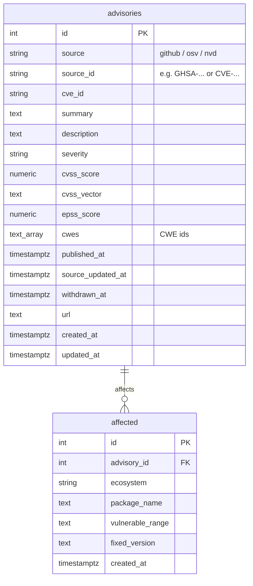

# DepWatch

A small vulnerability-intelligence platform we're building to learn data engineering and applied AI. It ingests public security advisories, indexes them, and (later) uses an LLM agent to flag which of our own dependencies are actually at risk.

Built in stages. **Right now: Stage 2 just landed** — the app schema (`advisories` + `affected`) is designed and live in Postgres (see [Schema](#schema)). Already done: **Stage 0** (Airflow + Postgres + Alembic) and **Stage 1a** (GHSA advisories → raw JSON in MinIO, run daily by an Airflow DAG). **Next:** Stage 1b — loading the raw advisories from MinIO into these tables.

## What's running

- **Apache Airflow 3.3.0** (LocalExecutor) — api-server, scheduler, dag-processor, triggerer. UI at `localhost:8080`.
- **Two Postgres containers:**
  - `postgres` (Postgres 16) — Airflow's own metadata.
  - `appdb` (Postgres 16 + pgvector) — our `depwatch` database, reachable at `localhost:5433`. Under Alembic migration control; now holds the `advisories` and `affected` tables (see [Schema](#schema)), still empty until the Stage 1b loader runs.
- **MinIO** (S3-compatible object storage) — the raw landing zone for untouched advisory JSON. Console at `localhost:9001`.

Prometheus + Grafana arrive at Stage 5.

## What's built so far (the pipeline)

- `depwatch/config.py` — reads all config from `.env` in one place (DB URL, MinIO settings, GitHub token).
- `depwatch/storage/minio.py` — `miniIO` wrapper: ensure a bucket, write JSON objects.
- `depwatch/storage/postgres.py` — the SQLAlchemy 2.0 ORM models (`Advisory`, `Affected`) that define the [schema](#schema) below.
- `depwatch/sources/ghsa.py` — the GitHub Advisories client: `fetch_advisories()` (paginates the API via the `Link` header) and `ingest_raw()` (fetches + lands each page into MinIO).
- `dags/ingest_ghsa.py` — the daily Airflow DAG: read a watermark → fetch new advisories → land them in MinIO → save the new watermark.
- `dags/hellow_world.py` — a hello-world Airflow DAG, proving the orchestration runs.

The GHSA → MinIO ingestion runs daily on a schedule, and the curated tables are designed and migrated (below). Next up is the Stage 1b loader that reads the raw MinIO JSON and upserts it into `advisories` + `affected`.

## Schema

Two tables in the `depwatch` database — SQLAlchemy models in `depwatch/storage/postgres.py`, created via Alembic. Each advisory is stored **per source** and keyed by the pair `(source, source_id)`; the packages a vuln affects hang off it as child rows.



- **`advisories`** — one row per source's view of a vulnerability. `UNIQUE(source, source_id)` is the idempotency key: re-ingesting upserts instead of duplicating. The same vuln from GHSA and OSV is kept as *two* rows on purpose (different `source`); a later merge step reconciles them.
- **`affected`** — the packages a vuln hits, one row per package × version range. FK to `advisories` with `ON DELETE CASCADE`. `UNIQUE(advisory_id, ecosystem, package_name, vulnerable_range)` keeps re-ingest idempotent; `INDEX(ecosystem, package_name)` powers the "are we affected?" lookup.
- The pgvector embedding column is deliberately **not** here yet — it's added at Stage 3 once we pick the embedding model.

## Prerequisites

- **Docker Desktop**, ≥ 4 GB RAM (Settings → Resources).
- **Python 3.13** on your machine — for the venv that runs ingestion and migrations from the host.
- A free **GitHub personal access token** (see [GitHub token](#github-token)).

## Get it running

```bash
git clone <repo-url>
cd AIAIAIAIAIBIGDATA

cp .env.example .env               # local config; gitignored. Then add your token (below).

docker compose up airflow-init     # one-off: pulls images, migrates the metadata db, creates the login
docker compose up -d               # start everything (postgres, appdb, minio, airflow)
docker compose ps                  # every service should read "healthy"
```

First run pulls a few hundred MB of images — give it a few minutes.

### Host environment (for ingestion + migrations)

Some code runs on your machine, not in a container (the ingestion function and Alembic). One-time:

```bash
python3.13 -m venv .venv           # 3.13 to match the Airflow image
source .venv/bin/activate
pip install -r requirements.txt
```

## GitHub token

Ingestion calls the GitHub Advisories API. Unauthenticated you get 60 requests/hour; with a token, 5000. The data is public, so the token needs **no scopes**.

1. GitHub → Settings → Developer settings → Personal access tokens → **Fine-grained** → Generate.
2. Repository access: "Public Repositories (read-only)"; leave all permissions at **No access**.
3. Copy it and paste it into `.env`:
   ```
   GITHUB_TOKEN=github_pat_xxxxx
   ```

Each teammate uses their own token. `.env` is gitignored and never leaves your machine — never commit it or paste it anywhere shared.

## Pull advisories (ingestion)

With MinIO up and your token in `.env`, land some real advisories from the host venv:

```bash
.venv/bin/python -c "from depwatch.sources.ghsa import ingest_raw; print(ingest_raw(max_pages=3))"
```

- `max_pages=3` grabs ~300 advisories (3 pages of 100); drop it for the full backfill (~300 pages).
- Objects land under `raw-advisories/github/dt=<today>/advisories_p<N>.json` — one object per page, partitioned by the day you pulled.
- See them: open the MinIO console at `localhost:9001` (`minioadmin` / `minioadmin`) → `raw-advisories` bucket.

## Use it

- **Airflow UI** → <http://localhost:8080>, login `airflow` / `airflow`.
- **MinIO console** → <http://localhost:9001>, login `minioadmin` / `minioadmin`. Raw advisory JSON lives here.
- **App database** (not a web page — use a Postgres client): host `localhost`, port `5433`, database `depwatch`, user `depwatch`, password `root`. (Port 5433, not 5432, so it doesn't collide with a local Postgres.) Fastest, no install: `docker compose exec appdb psql -U depwatch -d depwatch`.

## Everyday commands

```bash
docker compose ps                        # status
docker compose logs -f airflow-scheduler # tail one service
docker compose down                      # stop everything, KEEP the data
docker compose down -v                   # stop AND wipe volumes (full reset: Postgres + MinIO)
```

`down` keeps your data in Docker volumes, so `up -d` picks up where you left off. Use `-v` only for a clean slate.

## Migrations (Alembic)

Alembic manages the `appdb` schema, run from your machine (needs the venv above), reaching `appdb` at `localhost:5433`:

```bash
alembic upgrade head               # apply all migrations
alembic revision -m "add findings" # start a new migration, then edit the generated file
alembic downgrade -1               # roll back one
alembic current                    # what's applied right now
```

Run from the repo root, so `alembic/env.py` can import `depwatch.config` (for the URL) and `depwatch.storage.postgres.Base` (so autogenerate can diff the models against the live DB). The `advisories` + `affected` tables are migrated in — see [Schema](#schema).

## Layout

```text
docker-compose.yaml     the whole stack (postgres, appdb, minio, airflow)
dags/                   Airflow DAGs (thin orchestration only)
depwatch/               the importable library — the real logic:
  config.py               all env/config read here
  sources/ghsa.py         GitHub Advisories client + raw ingest
  storage/minio.py        MinIO (object storage) wrapper
  storage/postgres.py     SQLAlchemy ORM models -> advisories, affected
alembic/                database migrations (+ alembic.ini at the root)
requirements.txt        host Python deps (requests, minio, Alembic, SQLAlchemy, ...)
.env.example            copy to .env (and add your GitHub token)
```

Credentials here are all throwaway local-dev values — fine for a laptop, not for anything real.
