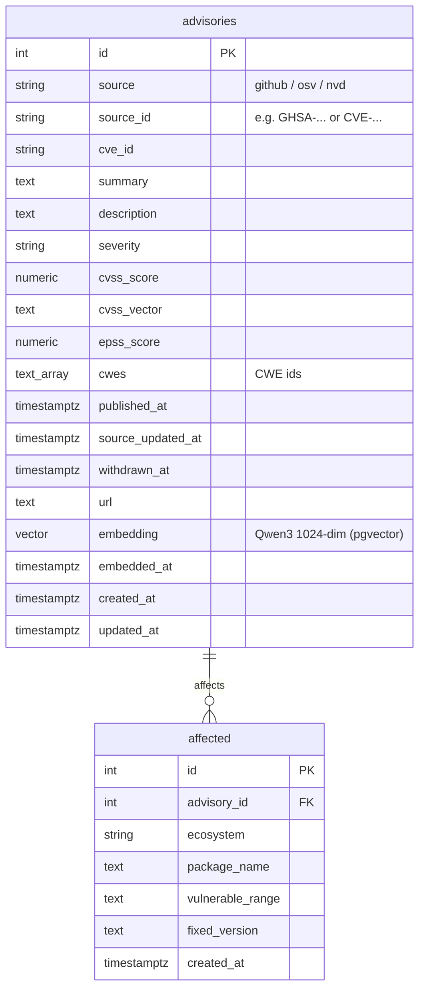

# DepWatch

A vulnerability-intelligence platform. It ingests public security advisories, indexes them for semantic search, and uses an LLM agent to flag which of a repo's dependencies are actually at risk. We're building toward a production, likely hosted service — in stages, core engine first — and learning data engineering + applied AI along the way.

Built in stages. **Right now: Stage 4 (the triage agent) is in progress.** Done so far: **Stage 0** (Airflow + Postgres + Alembic), **Stage 1** (GHSA advisories → raw JSON in MinIO daily, then loaded into `advisories` + `affected` — ~34k advisories), **Stage 2** (the app schema, see [Schema](#schema)), and **Stage 3** (semantic embeddings + vector retrieval, running on the Mac GPU — see [Embeddings & retrieval](#embeddings--retrieval-stage-3)). **Next:** Stage 4 — paste a repo URL → **OSV-SCALIBR** extracts its dependencies → deterministic version-matching → an LLM judges which are actually at risk.

## What's running

- **Apache Airflow 3.3.0** (LocalExecutor) — api-server, scheduler, dag-processor, triggerer. UI at `localhost:8080`.
- **Two Postgres containers:**
  - `postgres` (Postgres 16) — Airflow's own metadata.
  - `appdb` (Postgres 16 + pgvector) — our `depwatch` database, reachable at `localhost:5433`. Under Alembic migration control; holds the `advisories` and `affected` tables (see [Schema](#schema)), loaded with ~34k advisories, each carrying a pgvector embedding for semantic search.
- **MinIO** (S3-compatible object storage) — the raw landing zone for untouched advisory JSON. Console at `localhost:9001`.

Prometheus + Grafana arrive at Stage 5.

## What's built so far (the pipeline)

- `depwatch/config.py` — reads all config from `.env` in one place (DB URL, MinIO settings, GitHub token).
- `depwatch/storage/minio.py` — `miniIO` wrapper: ensure a bucket, write JSON objects.
- `depwatch/storage/postgres.py` — the SQLAlchemy 2.0 ORM models (`Advisory`, `Affected`) that define the [schema](#schema) below, plus `upsert_advisory()` (idempotent write) and `session_scope()`.
- `depwatch/sources/ghsa.py` — the GitHub Advisories client: `fetch_advisories()` (paginates via the `Link` header), `ingest_raw()` (lands each page in MinIO), and `load_ghsa()` (reads raw MinIO JSON → normalizes → upserts into `advisories` + `affected`).
- `depwatch/embedding/embed.py` — the Qwen3-Embedding-0.6B wrapper + `embed_new()`, which incrementally embeds any advisory that's new or changed since it was last embedded.
- `depwatch/embedding/retrieve.py` — `search()`: filter-then-rank vector retrieval (restrict to a package, then rank by cosine similarity). This is the "R" in the Stage 4 agent's RAG.
- `depwatch/embedding/service.py` — the host-side GPU launcher (Route B): a tiny FastAPI app the DAG POSTs to, so embedding runs on the Mac's GPU instead of in Docker.
- `dags/ingest_ghsa.py` — the daily Airflow DAG: watermark → fetch new advisories → land in MinIO → load into Postgres → embed (via the launcher).
- `dags/hellow_world.py` — a hello-world Airflow DAG, proving the orchestration runs.

The full daily pipeline — **fetch → land (MinIO) → load (Postgres) → embed (Mac GPU)** — runs unattended and idempotently. Next up is the Stage 4 agent that reads a repo's dependencies and reasons about real risk.

## Schema

Two tables in the `depwatch` database — SQLAlchemy models in `depwatch/storage/postgres.py`, created via Alembic. Each advisory is stored **per source** and keyed by the pair `(source, source_id)`; the packages a vuln affects hang off it as child rows.



- **`advisories`** — one row per source's view of a vulnerability. `UNIQUE(source, source_id)` is the idempotency key: re-ingesting upserts instead of duplicating. The same vuln from GHSA and OSV is kept as *two* rows on purpose (different `source`); a later merge step reconciles them.
- **`affected`** — the packages a vuln hits, one row per package × version range. FK to `advisories` with `ON DELETE CASCADE`. `UNIQUE(advisory_id, ecosystem, package_name, vulnerable_range)` keeps re-ingest idempotent; `INDEX(ecosystem, package_name)` powers the "are we affected?" lookup.
- **`advisories.embedding`** (`Vector(1024)`) — a Qwen3-Embedding-0.6B vector of each advisory's text, added at Stage 3, with an **HNSW** index for fast cosine similarity; `embedded_at` drives incremental re-embedding. This is what powers semantic retrieval (see [Embeddings & retrieval](#embeddings--retrieval-stage-3)).

## Prerequisites

- **Docker Desktop**, ≥ 4 GB RAM (Settings → Resources).
- **Python 3.13** on your machine — for the venv that runs ingestion and migrations from the host.
- A free **GitHub personal access token** (see [GitHub token](#github-token)).

## Get it running

```bash
git clone <repo-url>
cd AIAIAIAIAIBIGDATA

cp .env.example .env               # local config; gitignored. Then add your token (below).

docker compose up airflow-init     # one-off: pulls images, migrates the metadata db, creates the login
docker compose up -d               # start everything (postgres, appdb, minio, airflow)
docker compose ps                  # every service should read "healthy"
```

First run pulls a few hundred MB of images — give it a few minutes.

### Host environment (for ingestion + migrations)

Some code runs on your machine, not in a container (the ingestion function and Alembic). One-time:

```bash
python3.13 -m venv .venv           # 3.13 to match the Airflow image
source .venv/bin/activate
pip install -r requirements.txt
```

## GitHub token

Ingestion calls the GitHub Advisories API. Unauthenticated you get 60 requests/hour; with a token, 5000. The data is public, so the token needs **no scopes**.

1. GitHub → Settings → Developer settings → Personal access tokens → **Fine-grained** → Generate.
2. Repository access: "Public Repositories (read-only)"; leave all permissions at **No access**.
3. Copy it and paste it into `.env`:
   ```
   GITHUB_TOKEN=github_pat_xxxxx
   ```

Each teammate uses their own token. `.env` is gitignored and never leaves your machine — never commit it or paste it anywhere shared.

## Pull advisories (ingestion)

With MinIO up and your token in `.env`, land some real advisories from the host venv:

```bash
.venv/bin/python -c "from depwatch.sources.ghsa import ingest_raw; print(ingest_raw(max_pages=3))"
```

- `max_pages=3` grabs ~300 advisories (3 pages of 100); drop it for the full backfill (~300 pages).
- Objects land under `raw-advisories/github/dt=<today>/run=<HHMMSS>/advisories_p<N>.json` — one object per page, partitioned by the day *and the run*, so two runs on the same day never overwrite each other (raw stays append-only).
- See them: open the MinIO console at `localhost:9001` (`minioadmin` / `minioadmin`) → `raw-advisories` bucket.

## Embeddings & retrieval (Stage 3)

Each advisory's text (`summary + description`) is turned into a 1024-dimension vector by **Qwen3-Embedding-0.6B** (a local, free, open model) and stored in the `advisories.embedding` pgvector column. Semantic search then means: embed a query, and find the advisories whose vectors are closest (cosine distance), accelerated by an **HNSW** index. `depwatch/embedding/retrieve.py`'s `search()` does *filter-then-rank* — narrow to a package first, then rank by similarity — which is what the Stage 4 agent will use.

**Why a host GPU launcher ("Route B").** Embedding is much faster on the Mac's GPU (Metal), but Docker containers can't reach it. So instead of embedding inside Airflow, a tiny FastAPI app runs **on your Mac** (`depwatch/embedding/service.py`); the DAG's `embed` task just POSTs to it, and the launcher spawns a short-lived process that loads the model on the GPU, embeds whatever's new, writes it back, and exits (freeing the RAM). The container stays lean — no torch, no model.

Run the launcher on your machine (it's what the DAG calls):

```bash
.venv/bin/uvicorn depwatch.embedding.service:app --host 0.0.0.0 --port 8000
```

On macOS it's kept running automatically by a launchd LaunchAgent (`~/Library/LaunchAgents/com.depwatch.embed-launcher.plist`, `RunAtLoad` + `KeepAlive`), so it survives logout/restart. Embed manually or search from the host venv:

```bash
# embed any advisories that are new/changed since last embed
.venv/bin/python -c "from depwatch.embedding.embed import embed_new; print(embed_new())"

# semantic search (optionally filtered to a package)
.venv/bin/python -c "from depwatch.embedding.retrieve import search; print(search('remote code execution in a yaml parser', k=5))"
```

## Use it

- **Airflow UI** → <http://localhost:8080>, login `airflow` / `airflow`.
- **MinIO console** → <http://localhost:9001>, login `minioadmin` / `minioadmin`. Raw advisory JSON lives here.
- **App database** (not a web page — use a Postgres client): host `localhost`, port `5433`, database `depwatch`, user `depwatch`, password `root`. (Port 5433, not 5432, so it doesn't collide with a local Postgres.) Fastest, no install: `docker compose exec appdb psql -U depwatch -d depwatch`.

## Everyday commands

```bash
docker compose ps                        # status
docker compose logs -f airflow-scheduler # tail one service
docker compose down                      # stop everything, KEEP the data
docker compose down -v                   # stop AND wipe volumes (full reset: Postgres + MinIO)
```

`down` keeps your data in Docker volumes, so `up -d` picks up where you left off. Use `-v` only for a clean slate.

## Migrations (Alembic)

Alembic manages the `appdb` schema, run from your machine (needs the venv above), reaching `appdb` at `localhost:5433`:

```bash
alembic upgrade head               # apply all migrations
alembic revision -m "add findings" # start a new migration, then edit the generated file
alembic downgrade -1               # roll back one
alembic current                    # what's applied right now
```

Run from the repo root, so `alembic/env.py` can import `depwatch.config` (for the URL) and `depwatch.storage.postgres.Base` (so autogenerate can diff the models against the live DB). The `advisories` + `affected` tables are migrated in — see [Schema](#schema).

## Layout

```text
docker-compose.yaml     the whole stack (postgres, appdb, minio, airflow)
dags/                   Airflow DAGs (thin orchestration only)
depwatch/               the importable library — the real logic:
  config.py               all env/config read here
  sources/ghsa.py         GitHub Advisories client + raw ingest + load_ghsa
  storage/minio.py        MinIO (object storage) wrapper
  storage/postgres.py     SQLAlchemy ORM models -> advisories, affected
  embedding/embed.py      Qwen3 embedder + incremental embed_new()
  embedding/retrieve.py   search(): filter-then-rank vector retrieval
  embedding/service.py    host GPU launcher (Route B) the DAG POSTs to
  agent/                  Stage 4 triage agent (in progress)
alembic/                database migrations (+ alembic.ini at the root)
requirements.txt        host Python deps (requests, minio, Alembic, SQLAlchemy, ...)
.env.example            copy to .env (and add your GitHub token)
```

Credentials here are all throwaway local-dev values — fine for a laptop, not for anything real.
